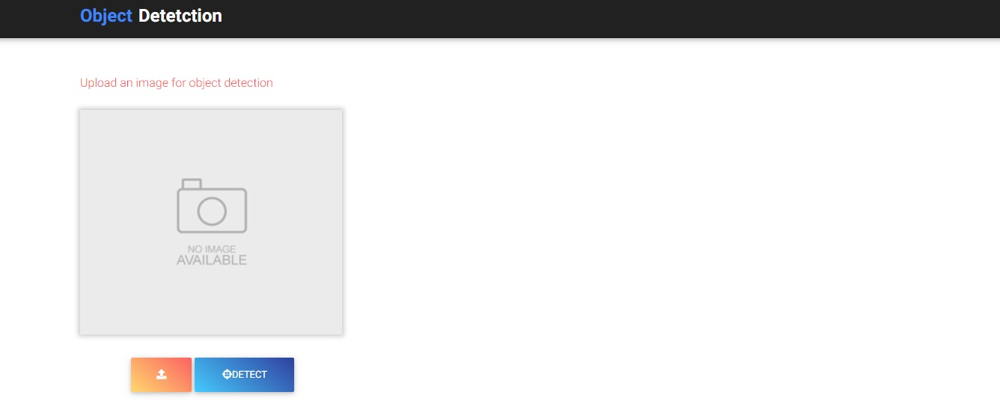
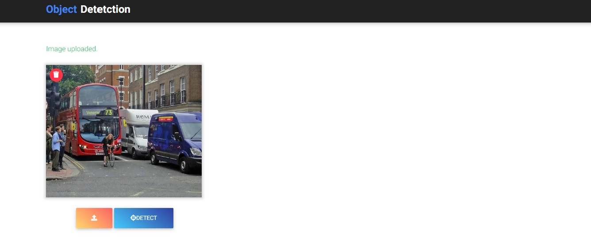
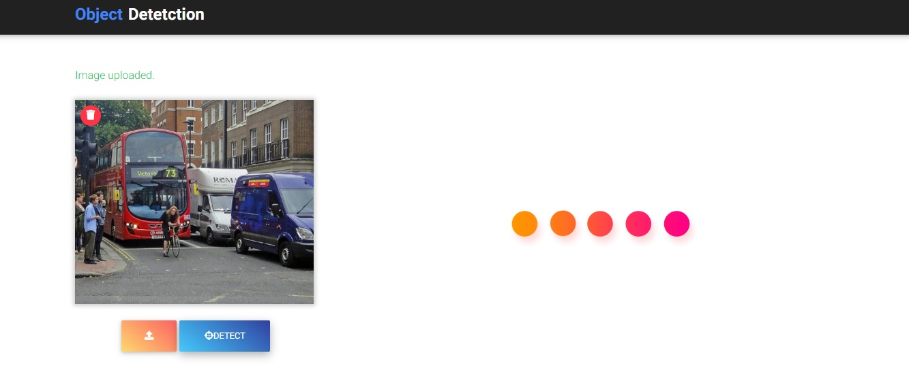
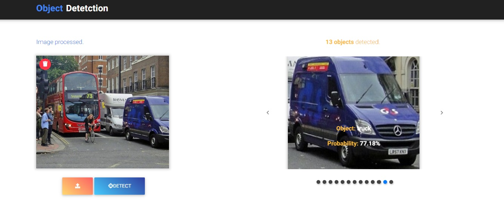

# Object Detection with ImageAI
A minimalistic web application using Flask and ImageAI to detect objects in an image.

## Highlights from the app

### Landing page:

### Image uploaded:

### Processing uploaded image:

### Result page:

